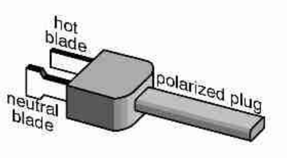

# Lamp "Clapper" Project

## Utilizing Frequency of Pitch

### Description
Arduino Project which takes in signal from user or source and transmit the frequencies received to turn on and turn off lamp.
Like the established “The Clapper”, this experiment will reflex from a given sound and pattern. Once this has successfully operated as expected, we then move on to another process. This next step is to activate based on pitch in frequency instead of sound.

### Introduction
This project was inspired from a college student’s perspective. After hours of lectures, study sessions and being away from the dorm, we are drained by the end of day and still have to research or review assignments. During moments of late night studying we are sometimes far from the lights and tend to fall asleep; at least I do at times... 👀. This project is the solution to simply our life by "vocally" triggering the lights without getting out of our comfty bed. 

### Materials

- Lamp with a power plug
- Arduino Uno R3 Board
- Sound Sensor Module
- 9V  Battery Clip
- 9V  Battery
- Dupont Wires  
- Developers Tool: Arduino IDE 1.8.19

 
  
Identify the positive wire (usually copper) on the lamp’s cord:   
The lamp’s plug has two blades of different widths.  
The widest blade is known as the neutral blade as the narrow blade is known as the hot blade.   
The hot blade is connected to the positive wire   
The neutral blade is connected to the neutral wire   

 

#### Electrical Wiring Instructions:

Cut the wire corresponding to the hot blade  
Cut off the polar wire  to reveal only the copper.  
Relay Module (terminal side):  
Insert the plug-sided wire in the NO input  
Insert the lamp-sided wire in the COM input (middle)   

#### <ins> Relay pins to Arduino </ins>  
Connect Relay Ground (-) pin to Arduino Ground pin  
Connect Relay 5V VCC  (+) pin to Arduino 5V power  
Connect Relay Input Signal (S) pin to Arduino’s Digital socket (between 2 and 13 ONLY)  

#### <ins> Sound sensor pins to Arduino </ins>  
Connect Sensor output (OUT) pin to Arduino’s Digital socket (between 2 and 13 ONLY)  
Connect Sensor Ground (GND) pin to Arduino Ground pin  
Connect Senor VCC  

You may now begin the fun!

Comments are displayed in the code itself. Click [here](/lamp_claper.ino) to view the code and comments.

### Glossary

COM – Common terminal  
GND (Ground) – the reference point for all signals or a common path in an electrical circuit where all of the voltages can be measured from.  
NC (Normally Closed terminal)  – keep the Relay closed so no circuit flows through, unless a signal is sent to open and stop the circuit.  
NO (Normally Open terminal) – allows circuit to come through automatically unless a signal is sent to close the circuit.  
VCC (Voltage Common Collector) – the higher voltage with respect to GND (ground).  

### References

Plug labels - https://www.boulderufixitclinic.org/lamp-repair  
Knowledge - https://randomnerdtutorials.com/guide-for-relay-module-with-arduino/

